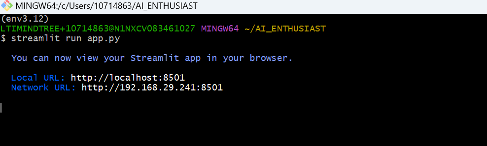

### How to setup this?

#### Pre-requisite:
1. Python 3.12
2. Need access to the CANVAS AI studio.
3. You need to create Space and embedding needs to be done with particular team. CANVAS AI support team will guide in the same.

#### Steps:
1. Download the folder.
2. Setup python virtual environment using command `python -m venv env3.12`
3. Activate virtual environment, using command `source env3.12/Scripts/activate`
4. Install requirements using  command `pip install -r requirements.txt`
4. Run the streamlit application using following command:
   `streamlit run app.py`
5. This will launch stramlit application.

6. Streamlit application will be launched:

7. You can see folder structure as follows:

